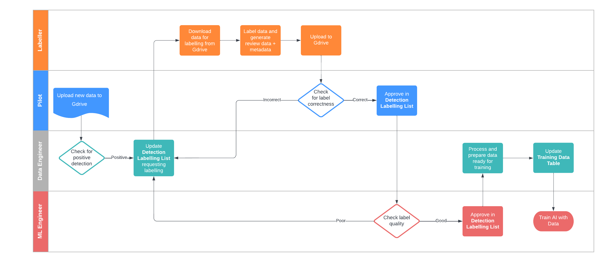

# data-labelling
## Setup
### 1. Clone repository
Run the command
```bash
git clone https://github.com/nsw-wildlife-drone-hub/data-labelling.git
```
Or alternatively manually download the code by clicking *Code* -> *Download ZIP*. The downloaded folder will then need to be unzipped and saved in a workspace.

## Labelling

### 1. Download Data
1. Determine a suitable detection to label in the **Detection Labelling List** and assign your name in the *Labeller* column
2. Download the .MP4 video and any jpg screenshot available
3. Move the downloads into the *Data/* folder in the *data-labelling* workspace
4. Create a new folder by the same name as the *labelling_foldername* column in the **Detection Labelling List**
5. Also rename the .MP4 video basename to the *labelling_foldername*

### 2. DarkLabel
First use the available screenshot to determine the target detection to label. the *time_in_video* column in the **Detection Labelling List** is also a useful guide to how far in the video is the detection visible.

To begin creating labels:
1. Open DarkLabel
2. Click 'Open Video' and select the .MP4 video
3. Maximize the window panel (this will give finer control of the mouse)
4. Scroll to when the detection first appears
5. Create a label
  - Left-click: draw a box
  - Shift+Right-click: delete box
  - Shift+Left-click: adjust box
  - Ctrl+Scroll: zoom in/out
  - Enter: predict next box
6. Save your Ground-truths (GT) by clicking 'GT Save As' and save in the new folder that was created


#### 2.1 Good vs bad labels

1. **Make tight boxes:** make the borders of the box touch the object, don't leave white space and definitely don't crop the object
2. **Do not abuse the predict tool:** it can save a lot of time but be sure to 'reset' the label manually after a number of frames so inaccuracies do not compound
3. **Label occluded objects:** if the object is partially hidden, ask yourself, can I still identify the animal in the picture?
4. **Take your time:** the accuracy of your label will affect the accuracy of the AI. Take a break if you need it, it will be worth it for everyone.

### 3. Extracting Images and Videos

Double-click **dataextect.exe**. This will automatically extract images and videos from the data. There will be 3 scans run and printed:
1. **Folders containing labels**: these are folders that have labels (.txt) found in them
2. **Folders with no images**: these are folders with labels (.txt) but no images (.jpg)
3. **Matching video data**: these are videos with the same name as the folder

Each time a labelling process is completed, there will be a dataset found to extract, otherwise, the program will ask to terminate. If no dataset is found to be extracted, check inside the label folder and also check the name of the folder and the video.

### 4. Compress labels
*(Option A)*
1. Zip the folder using 7-zip

*(Option B)*
1. Right-click the labels+images folder

2. Select *Send to -> Compressed (zipped) Folder*

### 5. Upload data

1. Upload the compressed folder to the **Data/** folder in Gdrive

2. Upload the output_gt.mp4 data to the **Review_AI** folder in Gdrive

3. Upload the output.mp4 data to the **Review_Pilot** folder in Gdrive


## Monitoring and Reviewing


On the **Detection Labelling List**, there will be a review procedure made by a pilot and the ML engineer to approve the quality of the data that is labelled. If at any stage, the quality does not pass the reviews, a note needs to be made by the reviewer as to why it was rejected. Following the review, the detection will be relabelled by the same labeller. The labels can be simply modified by *GT Load* into the DarkLabel and adjusting labels according to the notes.

## Packaging .py into .exe

Run the following commands to convert the python file into a packaged executable.

```bash
python -m venv pyinstall
.\pyinstall\Scripts\activate
pip install -r requirements.txt
pyinstaller --onefile dataextract.py
mv dist\dataextract.exe dataextract.exe -force
```
